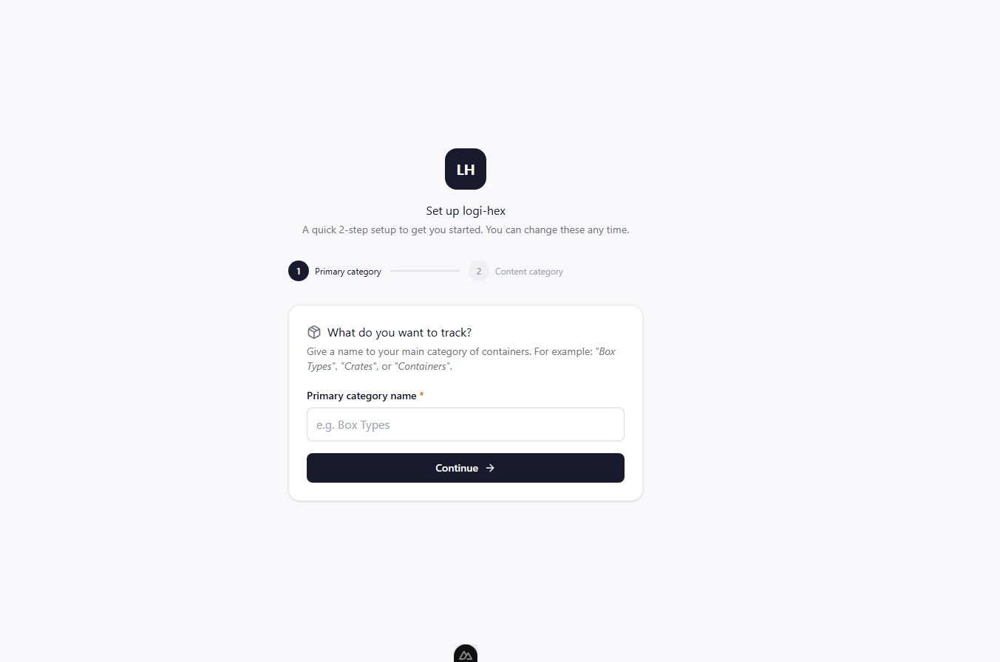
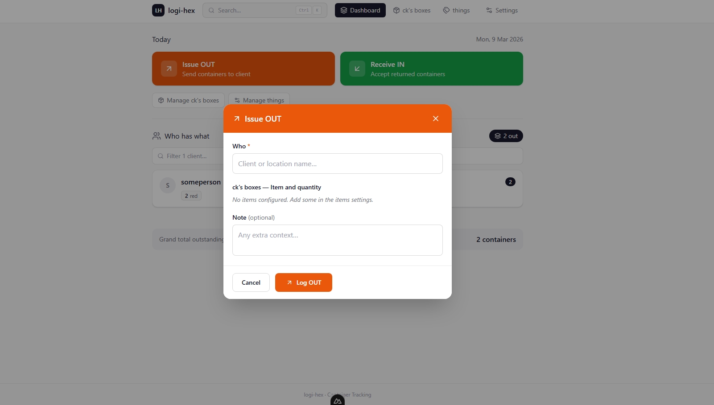

> ⚠️ **API & architecture have changed (workspaces refactor)**
>
> The code on `main` now uses a workspace-aware API with ACCOUNTS / INVENTORY
> modes and `/api/workspaces/{id}/...` endpoints.
>
> If you want the **new version** (recommended for future work):
>
> ```bash
> git checkout main
> ```
>
> If you need the **old, pre-workspaces API** exactly as shown in the demo below
> while the new UI is still in progress, use the legacy tag:
>
> ```bash
> git checkout v0.1-legacy
> # or
> git clone https://github.com/darksolitaire9-hub/logi-hex -b v0.1-legacy
> ```
>
> The legacy API (`/api/movements/issue`, `/api/summary`, etc.) is frozen and
> will not receive new features. All new work happens on `main`.


# logi-hex

logi-hex is a tiny, stubbornly practical app for tracking **things that come back**.

Crates. Trays. Camera lenses. Sample kits. Beer kegs. Mystery boxes.  
If you lend it and expect it back, logi-hex wants to remember it better than you do.

> Built with a hexagonal architecture, a real database, and a very patient AI collaborator.

---

## Demo 🎥 
[](https://youtu.be/KNqFUVO1yKk)
**click the image to watch**

## Screenshots 🖼️




## The story (and why this exists)

This started with a friend who runs a business.

He sends stuff out with customers. Most of it comes back.  
Some of it… **never does**.

They tried The Spreadsheet. It technically worked, but it felt like this:

```text
+-----------------------------+
|  Sheet1 (Final_v3_REAL.xlsx)|
+-----------------------------+
| A  | B    | C     | D      |
|----+------+-------+--------|
| ???| who? | what? | when?  |
+-----------------------------+
```

It was easy to forget to open it, to forget to log returns, to forget what the
columns meant. The tool itself was friction.

So logi-hex was born: a small tool that says:

- “Tell me who, what, and how many.”
- “I’ll remember, forever.”
- “I’ll politely stop you from doing impossible things, like returning more than you gave out.”

Right now, it’s being **dogfooded** in that real business:
what you see is what’s actually used to keep their stuff flowing.

---

## How data flows (end-to-end)

Let’s follow a single movement: you issue 3 “Large Crates” to “Alice”.

### Step 1 — Frontend: user action

You open the **Issue OUT** modal, pick “Alice”, select “Large Crate” and enter `3`.

```text
[Human] → [Browser UI] → [API] → [Backend] → [Database]
    |         |             |        |          |
    |         |             |        |          +--> rows are written
    |         |             |        +--> domain rules decide if it's valid
    |         |             +--> HTTP POST /api/movements/issue
    |         +--> Vue form + composables
    +--> click, type, submit
```


### Step 2 — Frontend code: composables \& API

In the frontend:

- `LogModal.vue` builds a `LogMovementPayload`:

```ts
{
  direction: "OUT",
  clientName: "Alice",
  primaryCategoryId: "containers",
  containerTypeId: "large-crate",
  quantity: 3,
  contentTypeIds: ["frozen"], // optional tags
  note: "Launch-week delivery"
}
```

- `useApp.logMovement` calls `logMovementApi(payload)`.
- `logMovementApi` sends a `POST` to `/api/movements/issue`.

Visually:

```text
+-------------------+
|   LogModal.vue    |
|-------------------|
| build payload     |
| validate form     |
+---------+---------+
          |
          v
+-------------------+
|   useApp()        |
|-------------------|
| logMovement(...)  |
|  → logMovementApi |
+---------+---------+
          |
          v
+-------------------+
|  /api/movements   |
|   (ofetch)        |
+-------------------+
```


### Step 3 — API layer: FastAPI adapter

FastAPI receives JSON at `/api/movements/issue` and:

1. Validates it against a Pydantic model.
2. Injects a `LogiFacade` instance via dependency injection.
3. Calls `facade.issue_items(...)` with domain-flavored arguments.
```text
HTTP JSON
   |
   v
+------------------------+
| FastAPI route handler  |
|------------------------|
| parse request body     |
| call LogiFacade        |
+-----------+------------+
            |
            v
+------------------------+
|     LogiFacade         |
| (application layer)    |
+------------------------+
```


### Step 4 — Application layer: LogiFacade

`LogiFacade` coordinates the use case:

- Looks up or creates the `Client` (“Alice”).
- Delegates to domain services (`issue_items` / `issue_containers`).
- Uses repositories via ports to persist transactions.
- Commits the Unit of Work.

In pseudocode:

```python
client = await client_repo.get_or_create_by_name("Alice")
tx = await services.issue_items(
    name=client.name,
    primary_item_quantities={"large-crate": 3},
    secondary_item_ids=content_type_ids,
    notes=note,
    ...
)
await uow.commit()
```


### Step 5 — Domain layer: rules and invariants

The domain service checks:

- Does the primary category exist and enforce returns?
- Does the tracking item `"large-crate"` exist, belong to that category, and is it active?
- Are secondary (content) items valid and active?

If everything is OK:

- It creates a `Transaction` entity with:
    - A fresh UUID.
    - Timestamp.
    - Client ID + name.
    - Direction `OUT`.
    - Line items and secondary items.
- The infrastructure layer then persists it.

If something is **not** OK (e.g. returning more than outstanding), the domain
raises an exception. The API turns that into a structured error, and the frontend
shows it inline in the modal.

```text
+-----------------------------+
|       domain/services       |
|-----------------------------|
| issue_items / return_items  |
|  - validate category        |
|  - validate items (active)  |
|  - enforce balances         |
+-----------------------------+
            |
            v
+-----------------------------+
|      domain/entities        |
|  Transaction, Client, etc.  |
+-----------------------------+
```


### Step 6 — Infrastructure: SQL + summary

Transactions are written into the database. A separate query layer computes:

- Balances (`OUT - IN`) per `(client, item)` pair.
- Per-client summaries.
- The grand total.

The dashboard calls `/api/summary`, which returns:

```json
{
  "clients": [
    {
      "client_name": "Alice",
      "total_outstanding": 3,
      "balances": [
        {
          "container_label": "Large Crate",
          "container_type_id": "large-crate",
          "balance": 3
        }
      ]
    }
  ],
  "grand_total": 3
}
```

The frontend maps this to a human-friendly table.

---

## A fun little map of the system

Here’s the “big picture” in ASCII:

```text
        +--------------------+
        |     Browser UI     |
        |  (Vue components)  |
        +---------+----------+
                  |
                  v
         +--------+---------+
         |  useApp compos.  |
         | (state + API)    |
         +--------+---------+
                  |
                  v
         +--------+---------+
         |  FastAPI routes  |
         | (/api/*)         |
         +--------+---------+
                  |
                  v
         +--------+---------+
         |   LogiFacade     |
         | (application)    |
         +--------+---------+
                  |
                  v
    +-------------+-------------+
    |        Domain layer       |
    |  entities + services      |
    +------+------+------------+
           |      |
           v      v
+----------+--+ +--+-----------+
| Repos & DB | | Summary /     |
| (SQLAlchemy| | Balance queries|
+------------+ +---------------+
```

And somewhere slightly off to the side, there’s an AI assistant helping design
this flow:

```text
      +-----------------------------+
      |  AI collaborator (this)     |
      |  - suggests architecture    |
      |  - helps write tests        |
      |  - helps write README       |
      +-----------------------------+
```


---

## Tech stack

| Layer | Tools |
| :-- | :-- |
| Backend | Python 3.12+, FastAPI |
| Packaging | [uv](https://github.com/astral-sh/uv) |
| ORM | SQLAlchemy (async) |
| Database | SQLite (development) |
| Frontend | Vue 3 / Composition API |
| Frontend PM | pnpm |
| HTTP client | ofetch |


---

## Getting started

### Environment setup

**Backend** — create a `.env` file in the repo root:

```env
APP_TITLE=logi-hex
CORS_ORIGINS=["http://localhost:3000"]
DATABASE_URL=sqlite+aiosqlite:///./logi.db
DEBUG=true
```

**Frontend** — create a `.env` file inside the `frontend/` folder:

```env
API_URL=http://localhost:8000
NUXT_PUBLIC_API_URL=http://localhost:8000
```

The defaults work out of the box for local development — you only need to change these if you use a different port, database path, or deploy to production.

### Backend (uv)

```bash
# from repo root
1. uv sync
2. alembic upgrade head


# start the API server
uv run main.py

```

API: `http://localhost:8000`


### Frontend (pnpm)

```bash
cd frontend
pnpm install
pnpm run dev   
```

App: `http://localhost:3000`


---

## How to actually use it

1. **Define your world**
    - Create a primary category (e.g. “Containers”, “Assets”).
    - Create a content category (e.g. “Tags”, “Notes”).
2. **Add items and tags**
    - Add the actual items you lend (“Large Crate”, “Demo Kit A”).
    - Add tags that matter (“Frozen”, “Urgent”, “Trial”, “VIP”).
3. **Log movements**
    - When something goes out, log an **OUT** movement.
    - When it comes back, log an **IN** movement.
    - The app enforces that you can’t return more than you’ve ever sent.
4. **Read the dashboard**
    - See who currently owes you what.
    - See total outstanding items across everyone.
5. **Evolve without losing history**
    - If you retire an item, delete it (soft delete).
    - If you bring it back, re-add with the same label and the history reconnects.

---

## Roadmap

Short-term:

- **Client detail view**
Click a client on the dashboard to open a table of all their movements.
- **Movement history UI**
A timeline of all IN/OUT movements, filterable by client, item, tag, or date.
- **Workspaces**
Multiple independent spaces in a single deployment (e.g. different teams or businesses).
- **More modular frontend state**
Breaking `useApp` into smaller composables like `useSummary`, `useTrackingItems`, `useClients`, etc.

---

## AI as a collaborator

This project has been actively developed with the help of an AI assistant:

- Refactoring and shaping the hexagonal architecture.
- Designing and adjusting domain services and test cases.
- Wiring frontend composables to backend APIs.
- Writing and revising this README.

Think of the AI as a **pair programmer and technical editor** sitting next to the human author, nudging the design toward clarity and consistency.

---

## Contributing

logi-hex is young, used in a real business, and open to ideas.

- If you track things that come back, your perspective is especially valuable.
- Open an issue to talk through a use case or a change.
- Keep domain rules in `domain/`, orchestration in `application/`, and framework details in adapters and infrastructure.
- Tests for domain logic, soft delete behavior, and balance enforcement are very welcome.

---

## License

This project is licensed under the **MIT License**.
See the [`LICENSE`](./LICENSE) file for details.

Certain UI ideas and components are inspired by [shadcn/ui](https://ui.shadcn.com/) (MIT).
Design mockups may include photos from [Unsplash](https://unsplash.com) under the Unsplash license.
